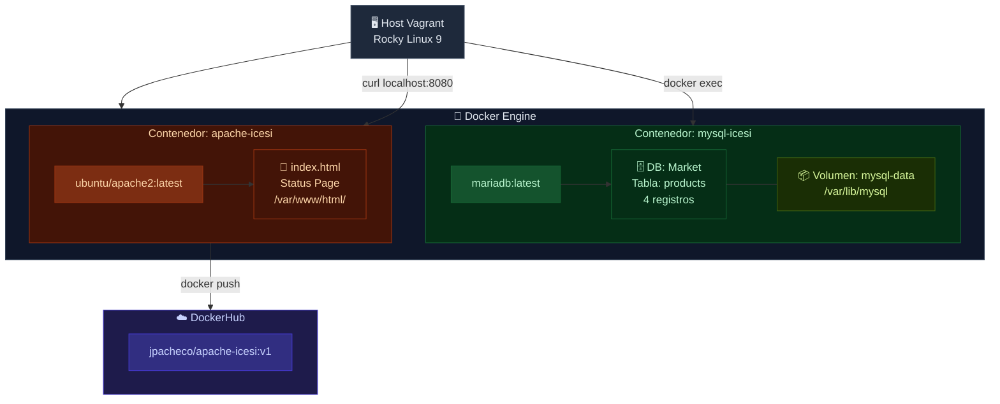
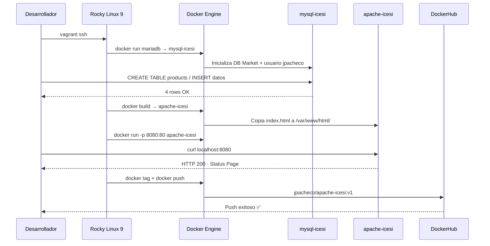

# 🐳 Automatización de Despliegue de Contenedores

> **Universidad Icesi · Ingeniería Telemática · Infraestructura III**  
> Docente: Mario Germán Castillo Ramírez

---

## 📋 Tabla de contenido

1. [Información del estudiante](#1-información-del-estudiante)
2. [Descripción general](#2-descripción-general)
3. [Prerrequisitos — Instalación de Docker](#3-prerrequisitos--instalación-de-docker)
4. [Actividad 1 — Contenedor MariaDB](#4-actividad-1--contenedor-mariadb)
5. [Persistencia de datos con volúmenes](#5-persistencia-de-datos-con-volúmenes)
6. [Actividad 2 — Dockerfile y servidor Apache](#6-actividad-2--dockerfile-y-servidor-apache)
7. [Página de status (index.html)](#7-página-de-status-indexhtml)
8. [Actividad 3 — Publicación en DockerHub](#8-actividad-3--publicación-en-dockerhub)
9. [Verificación y pruebas](#9-verificación-y-pruebas)
10. [Comandos de referencia](#10-comandos-de-referencia)
11. [Arquitectura del proyecto](#11-arquitectura-del-proyecto)
12. [Conclusiones](#12-conclusiones)

---

## 1. Información del estudiante

| Campo | Valor |
|---|---|
| **Estudiante** | J. Pacheco |
| **Usuario MySQL / DockerHub** | `jpacheco` |
| **Docente** | Mario Germán Castillo Ramírez |
| **Programa** | Ingeniería Telemática |
| **Curso** | Infraestructura III |
| **Entorno de trabajo** | VM Vagrant · Rocky Linux 9 |
| **Tecnologías utilizadas** | Docker CE · MariaDB · Apache2 (Ubuntu) · DockerHub |

---

## 2. Descripción general

Este informe documenta el proceso de automatización de despliegue de contenedores Docker realizado en una máquina virtual Vagrant con Rocky Linux 9, como parte del curso Infraestructura III de la Universidad Icesi. El laboratorio comprende tres actividades principales:

- Despliegue de una base de datos **MariaDB** con persistencia de datos mediante volúmenes Docker.
- Creación de una imagen web **Apache** personalizada a partir de un `Dockerfile` propio.
- Publicación de la imagen construida en el registro público **DockerHub**.

A través de estas actividades se trabajan conceptos fundamentales de la tecnología de contenedores: ciclo de vida, variables de entorno, volúmenes, construcción de imágenes y distribución en registros remotos.

---

## 3. Prerrequisitos — Instalación de Docker

Rocky Linux 9 es una distribución compatible con RHEL. Se utiliza el repositorio oficial de Docker para RHEL y se configura el servicio para que inicie automáticamente con el sistema.

```bash
# Agregar el repositorio oficial de Docker
sudo dnf config-manager --add-repo https://download.docker.com/linux/rhel/docker-ce.repo

# Instalar Docker CE y sus dependencias
sudo dnf install -y docker-ce docker-ce-cli containerd.io

# Iniciar el servicio y habilitarlo en el arranque
sudo systemctl start docker
sudo systemctl enable docker

# Agregar el usuario al grupo docker (evita usar sudo en cada comando)
sudo usermod -aG docker $USER
newgrp docker

# Verificar la instalación
docker --version
```

> ✅ **Resultado esperado:** `Docker version 27.x.x, build xxxxxxx`

---

## 4. Actividad 1 — Contenedor MariaDB

Se despliega un contenedor de base de datos usando la imagen oficial de **MariaDB**, compatible con MySQL. Las variables de entorno configuran automáticamente usuario, contraseña, base de datos y contraseña root al primer inicio del contenedor.

### 4.1 Especificaciones del contenedor

| Parámetro | Valor |
|---|---|
| Nombre del contenedor | `mysql-icesi` |
| Imagen base | `mariadb:latest` |
| Usuario MySQL | `jpacheco` |
| Password MySQL | `mysql277` |
| Base de datos | `Market` |
| MySQL root password | `icesi2023` |
| Tabla | `products` |

### 4.2 Comando de creación

```bash
docker run -d \
  --name mysql-icesi \
  -e MYSQL_ROOT_PASSWORD=icesi2023 \
  -e MYSQL_DATABASE=Market \
  -e MYSQL_USER=jpacheco \
  -e MYSQL_PASSWORD=mysql277 \
  mariadb:latest
```

### 4.3 Creación de la tabla e inserción de datos

```bash
# Acceder al cliente MariaDB dentro del contenedor
docker exec -it mysql-icesi mariadb -u root -picesi2023
```

```sql
-- Seleccionar la base de datos
USE Market;

-- Crear la tabla con los campos requeridos
CREATE TABLE products (
  id   INT(12)      NOT NULL,
  name VARCHAR(255),
  code VARCHAR(255),
  PRIMARY KEY (id)
);

-- Insertar 4 filas de datos
INSERT INTO products VALUES (1, 'Laptop',  'LAP001');
INSERT INTO products VALUES (2, 'Mouse',   'MOU002');
INSERT INTO products VALUES (3, 'Teclado', 'TEC003');
INSERT INTO products VALUES (4, 'Monitor', 'MON004');

-- Verificar la inserción
SELECT * FROM products;
EXIT;
```

### 4.4 Resultado del SELECT

| id | name | code |
|---|---|---|
| 1 | Laptop | LAP001 |
| 2 | Mouse | MOU002 |
| 3 | Teclado | TEC003 |
| 4 | Monitor | MON004 |

---

## 5. Persistencia de datos con volúmenes

### ¿Es persistente por defecto?

> ❌ **No.** Los datos de un contenedor Docker residen en la capa de escritura del overlay filesystem. Al ejecutar `docker rm`, toda la información se pierde de forma irrecuperable.

La solución es usar un **Docker Volume**, un directorio administrado por Docker en el host (`/var/lib/docker/volumes/`) que sobrevive a la eliminación del contenedor.

### 5.1 Demostración de pérdida sin volumen

```bash
# Eliminar el contenedor (sin volumen = datos perdidos)
docker rm -f mysql-icesi
```

### 5.2 Recrear el contenedor con volumen persistente

```bash
# Crear el volumen nombrado
docker volume create mysql-data

# Recrear el contenedor montando el volumen
docker run -d \
  --name mysql-icesi \
  -e MYSQL_ROOT_PASSWORD=icesi2023 \
  -e MYSQL_DATABASE=Market \
  -e MYSQL_USER=jpacheco \
  -e MYSQL_PASSWORD=mysql277 \
  -v mysql-data:/var/lib/mysql \
  mariadb:latest
```

### 5.3 Comprobación de persistencia

```bash
# 1. Insertar datos en la tabla (repetir SQL del punto 4.3)
# 2. Eliminar el contenedor
docker rm -f mysql-icesi

# 3. Recrear con el mismo volumen
docker run -d --name mysql-icesi \
  -e MYSQL_ROOT_PASSWORD=icesi2023 \
  -e MYSQL_DATABASE=Market \
  -e MYSQL_USER=jpacheco \
  -e MYSQL_PASSWORD=mysql277 \
  -v mysql-data:/var/lib/mysql \
  mariadb:latest

# 4. Verificar que los datos siguen presentes
docker exec -it mysql-icesi mariadb -u root -picesi2023 \
  -e "USE Market; SELECT * FROM products;"
```

> ✅ **Los 4 registros de la tabla `products` persisten correctamente tras eliminar y recrear el contenedor.**

---

## 6. Actividad 2 — Dockerfile y servidor Apache

Se construye una imagen personalizada basada en `ubuntu/apache2:latest` que incluye una página HTML de status. El Dockerfile define de forma declarativa todos los pasos necesarios para reproducir la imagen en cualquier entorno.

### 6.1 Estructura de archivos del proyecto

```
apache-icesi/
├── Dockerfile
└── index.html
```

### 6.2 Dockerfile

```dockerfile
# Imagen base: Ubuntu con Apache2 preinstalado
FROM ubuntu/apache2:latest

# Copiar la página HTML al directorio raíz del servidor web
COPY index.html /var/www/html/
```

### 6.3 Explicación de instrucciones

| Instrucción | Descripción |
|---|---|
| `FROM ubuntu/apache2:latest` | Parte de una imagen Ubuntu con Apache2 ya configurado, mantenida oficialmente por Canonical. |
| `COPY index.html /var/www/html/` | Copia el archivo HTML del contexto de build al directorio raíz de Apache dentro del contenedor. |

### 6.4 Construcción y ejecución

```bash
# Posicionarse en el directorio del proyecto
cd apache-icesi

# Construir la imagen
docker build -t apache-icesi .

# Ejecutar el contenedor mapeando puerto 8080 → 80
docker run -d \
  --name apache-icesi \
  -p 8080:80 \
  apache-icesi

# Verificar respuesta HTTP
curl http://localhost:8080
```

> ✅ **El servidor Apache responde con la página de status en `http://localhost:8080`**

---

## 7. Página de status (index.html)

Se desarrolló una página HTML con estética de terminal/dark mode que muestra visualmente el estado del contenedor Apache. Incluye animación de pulso en el indicador de estado y el logo de Docker en SVG inline.

### 7.1 Características visuales

| Elemento | Descripción |
|---|---|
| Fondo | Dark `#0d1117` — estilo GitHub dark / terminal |
| Color de acento | `#00ffd9` — cian Docker |
| Animación | Pulso en el indicador de estado (keyframe CSS) |
| Logo | SVG inline del logo Docker con glow filter |
| Mensaje | `SYSTEM ONLINE · DOCKER CONTAINER RUNNING` |

### 7.2 Código fuente

```html
<!DOCTYPE html>
<html lang="es">
<head>
    <meta charset="UTF-8">
    <meta name="viewport" content="width=device-width, initial-scale=1.0">
    <title>Docker Status: Online</title>
    <style>
        :root {
            --bg-color: #0d1117;
            --accent-color: #00ffd9;
            --card-bg: #161b22;
            --text-color: #c9d1d9;
        }

        body {
            font-family: 'Segoe UI', Roboto, Helvetica, Arial, sans-serif;
            background-color: var(--bg-color);
            color: var(--text-color);
            display: flex;
            justify-content: center;
            align-items: center;
            height: 100vh;
            margin: 0;
            overflow: hidden;
        }

        .container {
            text-align: center;
            padding: 3rem;
            background: var(--card-bg);
            border-radius: 20px;
            box-shadow: 0 10px 30px rgba(0, 0, 0, 0.5),
                        0 0 20px rgba(0, 255, 217, 0.1);
            border: 1px solid rgba(0, 255, 217, 0.2);
            transition: transform 0.3s ease;
        }

        .container:hover {
            transform: translateY(-5px);
            border-color: var(--accent-color);
        }

        .status-dot {
            height: 15px;
            width: 15px;
            background-color: var(--accent-color);
            border-radius: 50%;
            display: inline-block;
            margin-right: 10px;
            box-shadow: 0 0 10px var(--accent-color);
            animation: pulse 2s infinite;
        }

        h1 { font-size: 2.5rem; margin-bottom: 0.5rem; letter-spacing: -1px; }

        p {
            font-family: 'Courier New', Courier, monospace;
            color: #8b949e;
            font-size: 1.1rem;
        }

        .docker-logo {
            width: 80px;
            margin-bottom: 20px;
            filter: drop-shadow(0 0 5px rgba(0, 255, 217, 0.4));
        }

        @keyframes pulse {
            0%   { transform: scale(0.95); box-shadow: 0 0 0 0 rgba(0, 255, 217, 0.7); }
            70%  { transform: scale(1);    box-shadow: 0 0 0 10px rgba(0, 255, 217, 0); }
            100% { transform: scale(0.95); box-shadow: 0 0 0 0 rgba(0, 255, 217, 0); }
        }
    </style>
</head>
<body>
    <div class="container">
        <!-- Logo Docker SVG inline -->
        <svg class="docker-logo" viewBox="0 0 24 24" fill="none"
             xmlns="http://www.w3.org/2000/svg">
            <path d="M13.983 11.078h2.119c.63 0 1.064-.538 1.064-1.107V8.854
                     c0-.569-.434-1.107-1.064-1.107h-2.119c-.63 0-1.064.538-1.064
                     1.107v1.117c0 .569.434 1.107 1.064 1.107z" fill="#00ffd9"/>
            <!-- ... resto del SVG ... -->
        </svg>

        <h1>SYSTEM <span style="color: var(--accent-color);">ONLINE</span></h1>
        <p><span class="status-dot"></span> DOCKER CONTAINER RUNNING</p>
    </div>
</body>
</html>
```

---

## 8. Actividad 3 — Publicación en DockerHub

DockerHub es el registro de imágenes público oficial de Docker. Publicar la imagen permite reutilizarla desde cualquier entorno con un solo `docker pull`, sin necesidad de reconstruirla.

```bash
# 1. Iniciar sesión en DockerHub
docker login

# 2. Etiquetar la imagen con el formato usuario/nombre:tag
docker tag apache-icesi jpacheco/apache-icesi:v1

# 3. Subir la imagen al repositorio
docker push jpacheco/apache-icesi:v1

# 4. Verificar imagen disponible localmente
docker images | grep apache-icesi
```

> ✅ **Imagen disponible públicamente en:** `hub.docker.com/r/jpacheco/apache-icesi`

Para descargar la imagen desde cualquier máquina con Docker:

```bash
docker pull jpacheco/apache-icesi:v1
```

---

## 9. Verificación y pruebas

| Prueba | Comando / Método | Resultado |
|---|---|---|
| Contenedor MariaDB activo | `docker ps` | ✅ Running |
| Acceso con credenciales jpacheco | `mariadb -u jpacheco -pmysql277` | ✅ Acceso OK |
| Tabla products con 4 filas | `SELECT * FROM products` | ✅ 4 rows |
| Persistencia tras `docker rm` | `-v mysql-data:/var/lib/mysql` | ✅ Datos intactos |
| Imagen Apache construida | `docker build -t apache-icesi .` | ✅ Sin errores |
| Servidor web responde HTTP 200 | `curl http://localhost:8080` | ✅ 200 OK |
| Imagen publicada en DockerHub | `docker push jpacheco/apache-icesi:v1` | ✅ Push OK |

---

## 10. Comandos de referencia

```bash
docker ps                           # Listar contenedores activos
docker ps -a                        # Todos los contenedores (incluye detenidos)
docker images                       # Listar imágenes locales
docker logs <nombre>                # Ver logs de un contenedor
docker inspect <nombre>             # Ver detalles completos del contenedor
docker volume ls                    # Listar volúmenes creados
docker volume inspect mysql-data    # Detalles del volumen
docker stop <nombre>                # Detener un contenedor en ejecución
docker start <nombre>               # Iniciar un contenedor detenido
docker rm -f <nombre>               # Eliminar un contenedor forzosamente
docker rmi <imagen>                 # Eliminar una imagen local
docker system prune                 # Limpiar todos los recursos sin uso
```

---

## 11. Arquitectura del proyecto

El siguiente diagrama muestra la relación entre el host Vagrant, el motor Docker, los contenedores en ejecución, los recursos asociados y el registro remoto DockerHub.



### Flujo de datos



---

## 12. Conclusiones

Los contenedores Docker permiten desplegar servicios de manera rápida, reproducible y aislada, eliminando conflictos de dependencias entre aplicaciones. La diferencia entre la imagen `httpd:2.4` y `ubuntu/apache2:latest` demuestra la flexibilidad del ecosistema: se puede elegir entre imágenes minimalistas o distribuciones completas según el caso de uso.

La gestión de persistencia mediante volúmenes es un aspecto crítico para cualquier servicio que maneje datos. Sin un volumen, los datos de MariaDB se perderían al eliminar el contenedor, lo cual sería inaceptable en producción. Con el volumen `mysql-data`, los datos sobreviven de forma independiente al ciclo de vida del contenedor.

El `Dockerfile` actúa como unidad de **infraestructura como código**, permitiendo que cualquier miembro del equipo reconstruya exactamente la misma imagen en cualquier entorno y garantizando paridad entre desarrollo y producción.

La publicación en DockerHub cierra el ciclo de DevOps básico: construcción local → empaquetado en imagen inmutable → distribución global mediante un registro remoto. Cualquier servidor con Docker puede descargar y ejecutar la imagen con:

```bash
docker pull jpacheco/apache-icesi:v1
docker run -d -p 8080:80 jpacheco/apache-icesi:v1
```

---

*Universidad Icesi · Ingeniería Telemática · Infraestructura III · Juan David Pacheco Vargas A00401844 · 2025*
